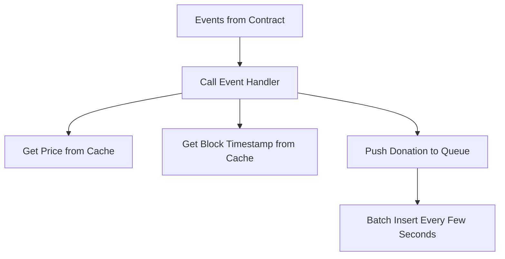

# Donation Indexing

Handling donations and stats efficiently is crucial, especially when reindexing. With over 1 million votes, live indexing isn't a major issue, but reindexing poses challenges.

It's critical to ensure that any changes to the donation event handler do not slow down the indexing process, as this would significantly impact overall indexing time.

### Challenges

1. **Keeping Stats Up to Date** Each donation updates stats at the application and round level. Calculating these stats on each donation is not feasible.
2. **Donation Conversion**: Each donation amount needs to be converted to USD and round tokens.
3. **Timestamp Handling**: `getLogs` does not give you timestamps for each event. We must fetch the timestamp for each donation using an RPC call to `getBlock`.
4. **Database Insertion**: Each vote must be inserted into the database.

### Performance Considerations

### Caching

- **Logs Caching**: Donation logs are cached to avoid having to call the RPCs.
- **USD Prices Caching**: Exchange rates for converting donations to USD are cached.
- **getBlock Calls Caching**: The results of `getBlock` calls are cached to minimize RPC calls.

### Donation Batching

- **Batch Insertions**: Donations are not inserted individually. Instead, they are queued and batch inserted 1000 at a time. This reduces the number of database round trips, improving performance.

### Stats Updater

- **Deferred Stats Calculation**: Stats are updated in batches rather than on each donation. This helps in maintaining application and round-level stats efficiently without frequent recalculations.
- **Throttled Updates**: Stats updating is throttled to occur outside of the event handler. Since stats do not need to be immediately up-to-date, they can be updated at intervals (e.g., every minute). Refer to the `Database` class for more details.

